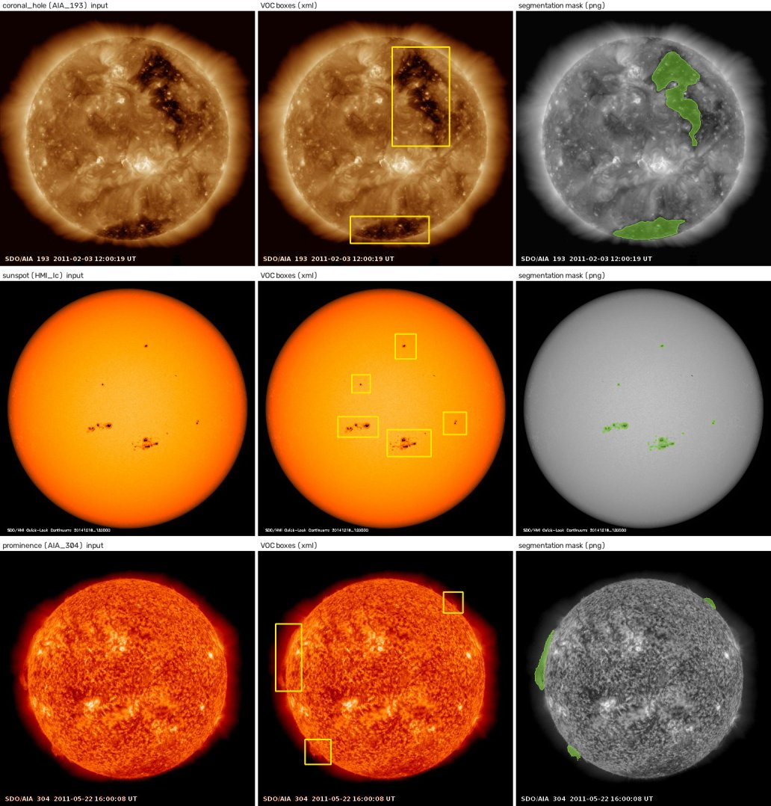
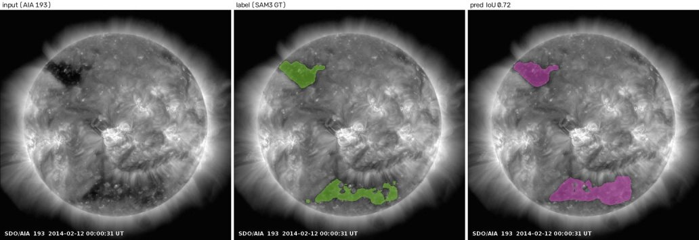
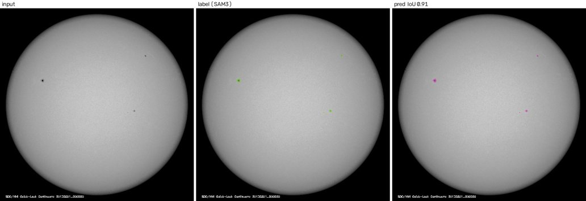
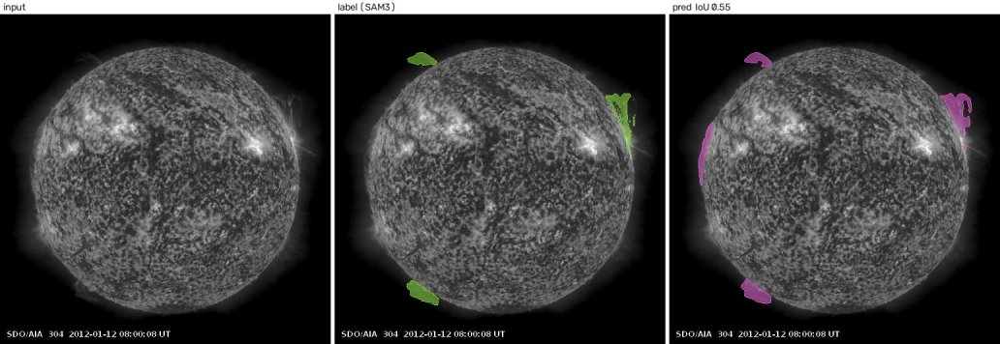

# SDO 태양 특징 세그멘테이션 베이스라인

**코로나홀 · 흑점 · 홍염**을 SDO(Solar Dynamics Observatory) 전면 디스크 영상에서 픽셀 단위로 분할하는 베이스라인 코드입니다.
대표적인 세그멘테이션 모델 3종(**U-Net, DeepLabV3, SegFormer**)을 하나의 학습 스크립트로 학습·평가·추론할 수 있습니다.



*각 행은 한 클래스의 test 프레임이다. 왼쪽부터 입력 영상, 원본 객체탐지 박스(VOC xml), 세그멘테이션 마스크(png, 초록)이다.*

---

## 목차

1. [빠른 시작](#1-빠른-시작)
2. [데이터셋](#2-데이터셋)
3. [모델](#3-모델)
4. [학습 설정](#4-학습-설정)
5. [평가 지표](#5-평가-지표)
6. [사용법](#6-사용법)
7. [참고 성능](#7-참고-성능)
8. [코드 구조](#8-코드-구조)
9. [주의사항](#9-주의사항)

---

## 1. 빠른 시작

```bash
# 1) 환경 (Python 3.11, CUDA GPU 1장)
python -m venv .venv && source .venv/bin/activate
pip install -r requirements.txt

# 2) 동봉된 소량 샘플(클래스별 train 2 · test 2 프레임)로 동작 확인
python scripts/check_data.py --data-root sample_data
python train.py --data-root sample_data --cls sunspot --arch unet --epochs 2 --bs 2

# 3) 전체 데이터를 data/ 에 배치한 뒤 학습 (아래 2절의 디렉터리 구조 참고)
python scripts/check_data.py --data-root data
python train.py --cls coronal_hole --arch unet
```

---

## 2. 데이터셋

### 2.1 개요

| 클래스 | 관측 채널 | 대상 | 기간 | train 프레임 | test 프레임 | 객체 박스 (train / test) | 전경 비율 |
|---|---|---|---|---|---|---|---|
| `coronal_hole` 코로나홀 | AIA 193 Å (EUV) | 디스크 위의 어두운 코로나홀 영역 | 2010-09 ~ 2019-12 | 4,068 | 1,017 | 7,934 / 2,050 | 2.6 – 3.1 % |
| `sunspot` 흑점 | HMI 연속광 (Ic) | 광구 위의 어두운 흑점 (암부 + 반암부) | 2010-09 ~ 2018-08 | 3,500 | 883 | 8,924 / 2,320 | 0.11 % |
| `prominence` 홍염 | AIA 304 Å (EUV) | 태양 가장자리(림브) 밖으로 돌출한 밝은 플라스마 | 2010-09 ~ 2017-12 | 2,340 | 586 | 7,418 / 1,823 | 0.8 % |

- 영상은 모두 **512 × 512 JPEG**입니다. 채널마다 SDO 표준 컬러맵이 입혀진 3채널 영상이지만, 정보는 밝기 하나뿐이므로 학습에는 **그레이스케일로 읽어** 사용합니다.
- 클래스마다 관측 채널이 다르므로, 한 프레임은 한 클래스에만 속합니다. 파일명의 채널 토큰(`AIA_193`, `HMI_Ic`, `AIA_304`)으로 클래스를 구분합니다.
- **전경 비율**은 마스크에서 특징이 차지하는 픽셀 비율의 평균입니다. 흑점은 0.1% 수준으로 극도로 불균형하며, 이 차이 때문에 손실 가중치를 클래스마다 다르게 둡니다(4.2절).
- 프레임 수는 연도별로 고르지 않습니다. 홍염은 2011년에 몰려 있고 2016년 이후는 매우 적습니다.

### 2.2 레이블

각 프레임에는 두 종류의 레이블이 있습니다.

| 파일 | 형식 | 내용 | 학습 사용 |
|---|---|---|---|
| `<stem>.xml` | Pascal VOC | 객체별 bounding box (`name` = 클래스명) | 사용 안 함 (참고·분석용) |
| `<stem>.png` | 512 × 512, 8-bit 단일 채널 | **세그멘테이션 마스크**. 255 = 특징, 0 = 배경 | **학습 타깃** |

- 마스크는 **프레임 단위**입니다. 한 프레임에 있는 해당 클래스의 모든 객체를 하나의 이진 마스크로 합친 것입니다.
- 이 저장소는 **모든 프레임의 세그멘테이션 레이블이 완성되어 있다고 가정**합니다. 마스크 파일이 없는 프레임은 "특징 없음"(빈 마스크)으로 취급합니다. 현재 데이터에서 마스크가 없는 프레임은 클래스당 0~64장입니다.
- 클래스별 레이블 정의는 다음과 같습니다.
  - **코로나홀**: AIA 193 Å 디스크 위에서 주변보다 뚜렷하게 어두운 영역. 디스크 밖은 포함하지 않습니다.
  - **흑점**: HMI 연속광에서 어두운 암부와 반암부. 작은 흑점은 수 픽셀 크기입니다.
  - **홍염**: AIA 304 Å에서 림브 밖으로 돌출한 밝은 구조. 림브에 붙은 뿌리 부분을 포함하며, 객체 박스 밖으로 이어지는 부분도 칠합니다.

### 2.3 디렉터리 구조

```
data/
├── images/
│   ├── train/
│   │   ├── 20100914_123342_SDO_AIA_193_512.jpg
│   │   ├── 20100914_123342_SDO_AIA_193_512.xml
│   │   ├── 20150715_120000_SDO_HMI_Ic_512.jpg
│   │   └── ...
│   └── test/
│       └── ...
└── masks/
    ├── coronal_hole/{train,test}/<stem>.png
    ├── sunspot/{train,test}/<stem>.png
    └── prominence/{train,test}/<stem>.png
```

- 파일명 규칙: `YYYYMMDD_HHMMSS_SDO_<CHANNEL>_512`. 마스크는 같은 `<stem>`에 `.png` 확장자를 씁니다.
- train/test 분할은 원본 데이터셋의 분할을 그대로 따릅니다(약 8 : 2).
- `sample_data/`에 같은 구조로 클래스별 train 2 · test 2 프레임이 들어 있어 설치 확인에 쓸 수 있습니다.
- 전체 데이터는 용량(영상 약 570MB) 때문에 저장소에 포함하지 않았습니다. 위 구조로 `data/`에 두거나 `--data-root`로 위치를 지정하세요.

데이터 구성을 점검하려면 다음을 실행합니다. 프레임·마스크·박스 개수와 전경 비율을 클래스별로 출력하고, 크기가 512 × 512가 아닌 마스크를 찾아냅니다.

```bash
python scripts/check_data.py --data-root data
```

### 2.4 입력 전처리와 증강

- 입력: 그레이스케일 `x / 255 − 0.5` (값 범위 −0.5 ~ 0.5)
- U-Net은 1채널, DeepLabV3·SegFormer는 같은 영상을 3채널로 복제해 입력합니다.
- 증강: 무작위 좌우 반전, 상하 반전. 전면 디스크 영상이라 반전해도 물리적 의미가 깨지지 않습니다.
- 리사이즈·크롭은 하지 않습니다. 512 × 512 원본 해상도 그대로 학습합니다.

---

## 3. 모델

세 모델 모두 **사전학습 가중치 없이 처음부터(from scratch)** 학습합니다. 태양 영상은 자연 영상과 분포가 크게 달라, 공정한 구조 비교를 위해 사전학습을 쓰지 않았습니다.

| `--arch` | 모델 | 파라미터 | 입력 | 특징 |
|---|---|---|---|---|
| `unet` | U-Net (Ronneberger et al., 2015) | 31.0M | 1채널 | 4단 인코더–디코더와 스킵 연결. 기본 채널 64, BatchNorm, 전치 합성곱 업샘플링 |
| `deeplabv3` | DeepLabV3 + ResNet-50 (Chen et al., 2017) | 39.6M | 3채널 | 팽창 합성곱(atrous) 백본과 ASPP로 다중 스케일 문맥 포착. torchvision 구현 |
| `segformer` | SegFormer MiT-B0 (Xie et al., 2021) | 3.7M | 3채널 | 계층형 Transformer 인코더와 MLP 디코더. 1/4 해상도 출력을 입력 크기로 쌍선형 업샘플 |

- 모든 모델은 입력과 같은 크기의 **로짓 맵 1장**을 출력합니다(이진 분할). 확률은 시그모이드, 기본 임계값은 0.5입니다.
- 구현: `solarseg/models.py`

---

## 4. 학습 설정

### 4.1 공통 설정

| 항목 | 값 |
|---|---|
| 손실 | BCE (양성 가중치 `pos_weight`) + soft Dice |
| 옵티마이저 | AdamW, weight decay 1e-4 |
| 학습률 스케줄 | Cosine annealing (epoch 단위) |
| 학습률 | U-Net 1e-3 · DeepLabV3 3e-4 · SegFormer 1e-3 |
| 배치 / epoch | 16 / 40 |
| 혼합 정밀도 | bf16 autocast (지원하지 않는 GPU는 fp16 + GradScaler). 손실은 fp32로 계산 |
| 그래디언트 클리핑 | L2 norm 5.0 |
| 모델 선택 | 매 epoch test 분할의 IoU가 가장 높은 체크포인트를 `best.pt`로 저장 |

모든 값은 명령줄 인자로 바꿀 수 있습니다(`--lr`, `--bs`, `--epochs`, `--pos-weight`).

### 4.2 클래스별 양성 가중치

전경 비율이 클래스마다 최대 약 25배 차이 나므로 BCE의 `pos_weight`를 클래스별로 둡니다.

| 클래스 | 전경 비율 | `pos_weight` |
|---|---|---|
| coronal_hole | ~2.7 % | 5 |
| prominence | ~0.8 % | 14 |
| sunspot | ~0.1 % | 40 |

`pos_weight`가 큰 흑점은 fp16에서 손실이 오버플로해 NaN이 된 적이 있습니다. 그래서 bf16을 기본으로 쓰고, 손실은 fp32로 계산하며, 그래디언트를 클리핑합니다.

### 4.3 하드웨어와 시간

RTX 3090 (24GB) 1장, 40 epoch 기준 학습 시간입니다.

| 모델 | 코로나홀 | 흑점 | 홍염 |
|---|---|---|---|
| U-Net | 약 90분 | 약 80분 | 약 55분 |
| DeepLabV3 | 약 70분 (32 epoch) | 약 70분 | 약 50분 |
| SegFormer | 약 20분 | 약 16분 | 약 10분 |

데이터는 학습 시작 시 RAM에 모두 올립니다(클래스당 수백 MB 이하).

---

## 5. 평가 지표

`solarseg/metrics.py`가 계산하며, 학습 로그와 `evaluate.py`가 같은 정의를 씁니다.

| 지표 | 정의 |
|---|---|
| **IoU** | 분할 전체 프레임의 교집합 합 ÷ 합집합 합 (데이터셋 단위 IoU). 모델 선택 기준 |
| **Dice** | 프레임별 Dice의 평균. 정답과 예측이 모두 빈 프레임은 1점 |
| Precision / Recall / F1 | 전체 프레임에서 누적한 픽셀 단위 TP · FP · FN으로 계산 |

데이터셋 단위 IoU는 큰 구조가 많은 프레임의 영향을 더 많이 받습니다. 작은 흑점처럼 객체 크기가 중요한 경우에는 Dice(프레임 평균)를 함께 보는 것이 좋습니다.

---

## 6. 사용법

### 6.1 학습

```bash
python train.py --cls coronal_hole --arch unet
python train.py --cls sunspot      --arch segformer
python train.py --cls prominence   --arch deeplabv3

# 하이퍼파라미터 변경
python train.py --cls sunspot --arch unet --epochs 60 --lr 5e-4 --pos-weight 30

# GPU 지정
CUDA_VISIBLE_DEVICES=1 python train.py --cls prominence --arch unet

# 3 클래스 × 3 모델 = 9개 베이스라인을 순서대로 학습하고 결과 표를 출력
GPU=0 DATA=data bash scripts/train_all.sh
```

주요 인자:

| 인자 | 기본값 | 설명 |
|---|---|---|
| `--cls` | (필수) | `coronal_hole`, `sunspot`, `prominence` |
| `--arch` | `unet` | `unet`, `deeplabv3`, `segformer` |
| `--data-root` | `data` | 2.3절 구조의 데이터 루트 |
| `--epochs` `--bs` `--lr` | 모델별 기본값 | 4.1절 |
| `--pos-weight` | 클래스별 기본값 | 4.2절 |
| `--require-mask` | 꺼짐 | 켜면 마스크 파일이 없는 프레임을 건너뜀 (기본은 빈 마스크로 사용) |
| `--limit` | 없음 | 분할마다 앞의 N 프레임만 사용 (동작 확인용) |
| `--run-dir` | `runs/<cls>/<arch>` | 출력 위치 |

DeepLabV3는 배치 크기 2 이상이 필요합니다. ASPP의 이미지 풀링 분기가 1×1 맵에 BatchNorm을 적용하기 때문입니다.

### 6.2 출력물

```
runs/<cls>/<arch>/
├── best.pt          가장 높은 val IoU epoch의 체크포인트 (model state, config, val 지표)
├── config.json      실행 설정 전체
├── history.json     epoch별 손실과 검증 지표
├── val_final.json   best.pt를 다시 불러 계산한 최종 지표
└── samples/         검증 프레임 8장: 입력 | 정답 | 예측 (프레임 IoU 표기)
```

`python scripts/summarize.py`는 `runs/` 아래 모든 결과를 Markdown 표로 모아 출력합니다.

### 6.3 평가

```bash
python evaluate.py --ckpt runs/sunspot/unet/best.pt --split test
python evaluate.py --ckpt runs/sunspot/unet/best.pt --split test --thr 0.4   # 임계값 변경
```

### 6.4 추론

```bash
# 폴더 전체: <stem>.png 마스크 저장, --overlay 로 겹친 영상도 저장
python predict.py --ckpt runs/prominence/unet/best.pt --input path/to/frames --out preds/ --overlay

# 한 장
python predict.py --ckpt runs/coronal_hole/segformer/best.pt --input frame.jpg --out preds/
```

입력은 학습 때와 같은 채널의 512 × 512 영상이어야 합니다. 폴더를 주면 파일명에 모델 채널 토큰이 있는 영상만 처리합니다(`--all-channels`로 해제).

---

## 7. 참고 성능

같은 코드 구조와 하이퍼파라미터로 학습한 내부 실행 결과입니다(test 분할, best epoch). 레이블 버전이나 난수에 따라 수 % 정도 달라질 수 있으니 재현 목표가 아닌 **기준점**으로 보세요.

| 클래스 | 모델 | IoU | Dice | Precision | Recall | 파라미터 |
|---|---|---|---|---|---|---|
| 코로나홀 | U-Net | 0.829 | 0.887 | 0.885 | 0.928 | 31.0M |
| 코로나홀 | DeepLabV3 \* | **0.842** | **0.898** | 0.897 | 0.932 | 39.6M |
| 코로나홀 | SegFormer | 0.822 | 0.886 | 0.883 | 0.922 | 3.7M |
| 흑점 | U-Net | **0.766** | **0.854** | 0.847 | 0.889 | 31.0M |
| 흑점 | DeepLabV3 | 0.604 | 0.736 | 0.672 | 0.858 | 39.6M |
| 흑점 | SegFormer | 0.698 | 0.810 | 0.784 | 0.865 | 3.7M |
| 홍염 | U-Net | **0.605** | **0.753** | 0.697 | 0.821 | 31.0M |
| 홍염 | DeepLabV3 | 0.594 | 0.744 | 0.700 | 0.797 | 39.6M |
| 홍염 | SegFormer | 0.574 | 0.726 | 0.664 | 0.808 | 3.7M |

\* 코로나홀 DeepLabV3는 배치 12, 32 epoch, `pos_weight` 3으로 학습한 결과입니다.

관찰:

- **코로나홀**은 큰 영역이라 세 모델 모두 IoU 0.82 이상으로 비슷합니다.
- **흑점**은 수 픽셀 크기 객체가 많아, 고해상도 특징을 그대로 전달하는 U-Net이 가장 좋습니다. 출력 해상도를 낮췄다가 키우는 DeepLabV3(1/8)와 SegFormer(1/4)는 작은 흑점에서 불리합니다.
- **홍염**은 경계가 흐린 구조라 세 모델 모두 상대적으로 낮고, 서로 차이가 작습니다.
- **SegFormer**는 파라미터가 1/10이고 학습 시간이 1/5인데도 U-Net에 근접합니다. 가벼운 모델이 필요하면 좋은 선택입니다.

예측 예시 (입력 | 정답 | 예측):





---

## 8. 코드 구조

```
.
├── train.py               학습 (클래스 · 모델 선택, best 체크포인트, 샘플 이미지)
├── evaluate.py            체크포인트 평가
├── predict.py             영상 → 마스크 추론
├── solarseg/
│   ├── config.py          클래스(채널, pos_weight)와 모델별 기본 하이퍼파라미터
│   ├── data.py            데이터셋 로더, VOC xml 파서, 단일 영상 로더
│   ├── models.py          U-Net · DeepLabV3 · SegFormer 생성
│   ├── losses.py          BCE(pos_weight) + Dice
│   ├── metrics.py         IoU · Dice · Precision · Recall · F1
│   └── viz.py             마스크 오버레이와 비교 패널
├── scripts/
│   ├── check_data.py      데이터 구성 점검과 통계
│   ├── train_all.sh       9개 베이스라인 일괄 학습
│   └── summarize.py       결과 표 생성
├── sample_data/           설치 확인용 소량 데이터 (클래스별 train 2 · test 2)
├── docs/figures/          README 그림
└── requirements.txt
```

새 클래스를 추가하려면 `solarseg/config.py`의 `CLASSES`에 채널 토큰과 `pos_weight`를 등록하고 `data/masks/<새 클래스>/`에 마스크를 두면 됩니다.

---

## 9. 주의사항

- **검증 = test 분할**: 별도 검증 분할 없이 test 분할로 best epoch를 고릅니다. 따라서 보고되는 test 성능은 약간 낙관적일 수 있습니다. 엄밀한 비교가 필요하면 train에서 날짜 기준으로 검증 분할을 떼어 내세요(같은 날 프레임이 양쪽에 섞이지 않도록).
- **날짜 상관**: 같은 날 여러 시각의 프레임이 있어 서로 매우 비슷합니다. 무작위 분할보다 날짜 단위 분할이 일반화 성능을 더 정직하게 보여 줍니다.
- **시기 편중**: 홍염은 2011년에, 흑점은 활동 극대기(2011~2015년)에 몰려 있습니다. 활동이 적은 시기의 성능은 따로 확인하는 것이 좋습니다.
- **영상 내 글자**: 일부 프레임에는 관측 시각 등 글자가 영상에 새겨져 있습니다. 마스크에는 포함되지 않지만 입력에는 남아 있습니다.
- **임계값**: 기본 0.5입니다. 흑점처럼 작은 객체는 `evaluate.py --thr`로 임계값을 조정하면 Recall과 Precision의 균형을 바꿀 수 있습니다.
- **GPU 메모리**: 참고 성능은 24GB GPU에서 배치 16으로 학습했습니다. 메모리가 부족하면 `--bs`를 줄이고 `--lr`도 비슷한 비율로 낮추세요.

### 데이터 출처

영상은 NASA SDO(Solar Dynamics Observatory)의 AIA와 HMI 관측 자료입니다.
*Courtesy of NASA/SDO and the AIA and HMI science teams.*

### 라이선스

코드 라이선스는 아직 정하지 않았습니다. 외부에 공개하기 전에 정해 주세요.
